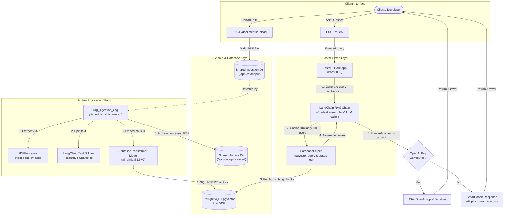
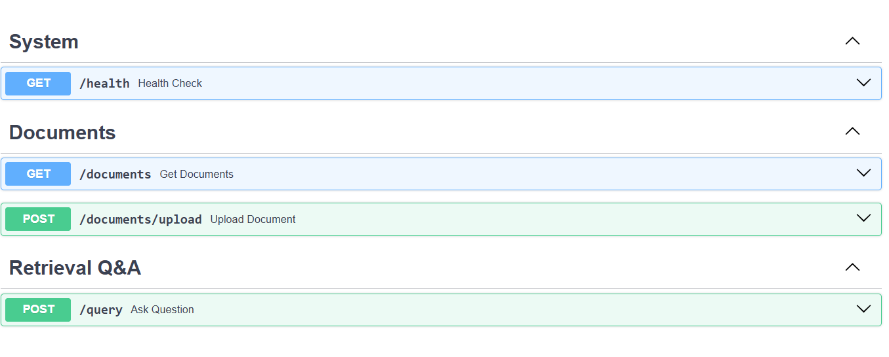
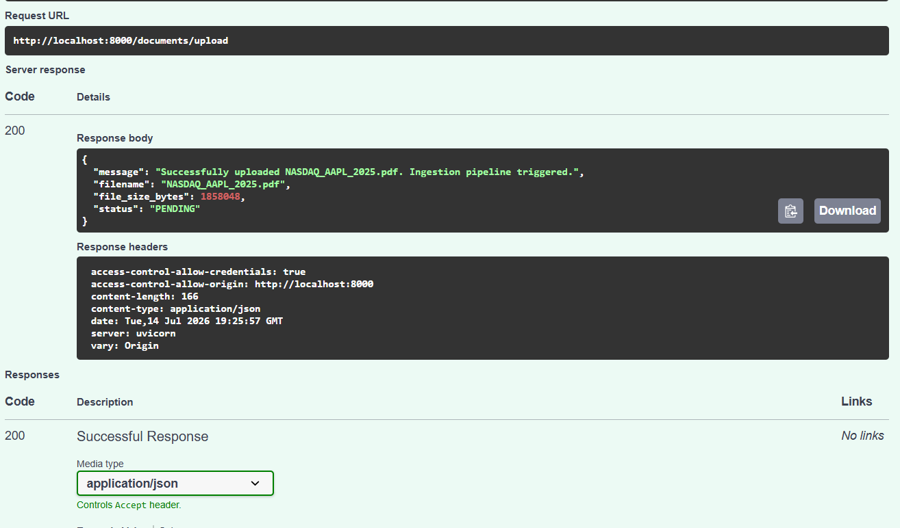
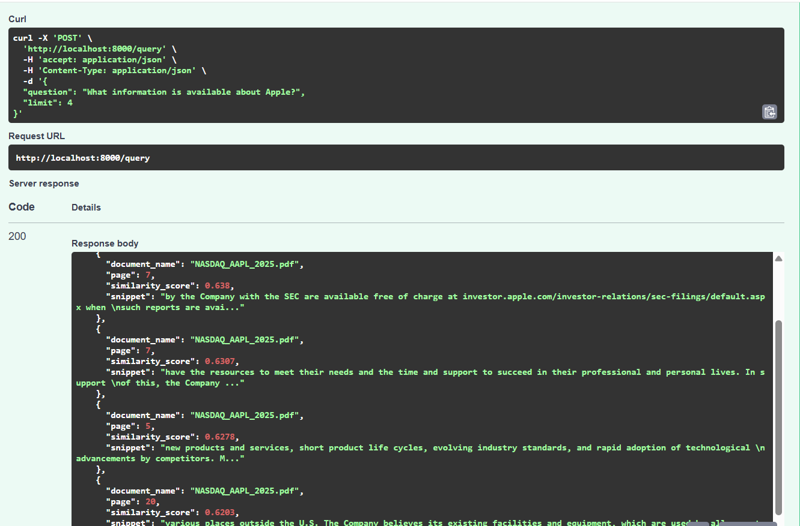

# Enterprise RAG Data Engineering Pipeline


A production-grade, enterprise-ready Retrieval-Augmented Generation (RAG) data engineering pipeline. It automates PDF ingestion, performs text chunking and metadata enrichment, generates vector embeddings, stores them in PostgreSQL `pgvector`, and exposes a FastAPI REST API for semantic search and Q&A powered by LangChain.

Designed to operate **100% locally and offline by default** (using SentenceTransformers), with **optional configuration for OpenAI GPT models**.

---

## 🏗️ Architecture & Decoupled Ingestion Flow

The application architecture utilizes a decoupled storage and processing pattern. Airflow monitors files and loads data asynchronously, while the FastAPI server acts as a low-latency query layer.



---

## 🛠️ Technology Stack

- **Orchestration**: Apache Airflow 2.9.2
- **Vector Database**: PostgreSQL 16 with `pgvector` extension and HNSW similarity indexing
- **Web Framework**: FastAPI & Uvicorn
- **AI Framework**: LangChain (Core, Community, OpenAI) & SentenceTransformers (`all-MiniLM-L6-v2` - 384 dimensional embeddings)
- **Containerization**: Docker & Docker Compose
- **Testing**: pytest

---

## 🚀 Getting Started

### 📋 Prerequisites
Ensure you have the following installed:
- [Docker & Docker Compose](https://www.docker.com/products/docker-desktop/)
- Python 3.10+ (for local scripts and testing)

### 1. Setup Environment
Clone the project, copy the environment file, and modify any parameters:
```bash
cp .env.example .env
```

If you plan to use OpenAI for answering questions:
- Open `.env` and fill in `OPENAI_API_KEY=your-api-key-here`.
- If left blank, the application will default to **Offline Mock Mode**, allowing you to test the vector extraction and pipeline mechanics with zero cost or internet requirements.

### 2. Generate Sample PDFs
We have included a script to generate two synthetic enterprise PDFs containing dummy policies and infrastructure specifications. Install `reportlab` or let the script auto-install it and generate the documents:
```bash
python scripts/generate_samples.py
```
This writes:
- `data/input/corporate_policy.pdf` (Vacation and Hybrid policies)
- `data/input/cloud_architecture.pdf` (AWS infrastructure and database failover setups)

### 3. Spin Up Docker Containers
Build and run the entire stack:
```bash
docker-compose up --build -d
```
This commands spins up:
- **`rag-postgres`**: Database containing pgvector. Automatically executes `scripts/init-db.sql` to install the extension and create schemas.
- **`airflow-db`**: Dedicated metadata store for Airflow.
- **`airflow-init`**: Automatically sets up the database schema and creates an admin user (User: `admin`, Password: `admin`).
- **`airflow-webserver` & `airflow-scheduler`**: Core Airflow components.
- **`fastapi-api`**: FastAPI application exposing REST endpoints on port `8000`.

*Note: The first startup may take a few minutes as Docker downloads base layers and Airflow installs its dependencies.*

---

## 🔍 Ingestion Pipeline Internals (Airflow)

The Airflow DAG runs on a **1-minute cron scheduler** (customizable in the DAG).

1. **File Detection**: Scans `/app/data/input` for `.pdf` files.
2. **Text Processing**: Page-by-page text extraction. Uses LangChain's `RecursiveCharacterTextSplitter` with `chunk_size=500` and `chunk_overlap=50` to split paragraphs into overlapping segments.
3. **Metadata Injection**: Every chunk is appended with page metadata (e.g. `{"page": 2, "total_pages": 4}`) to trace sources.
4. **Vector Generation**: Converts chunks into 384-dimensional embeddings using `sentence-transformers/all-MiniLM-L6-v2`. This model is baked directly into the Docker images at build time, resulting in instantaneous runs without model-download overhead.
5. **Database Transaction**: Chunks are written to PostgreSQL. We use a **truncate-and-replace** operation per document. This ensures that if you re-upload a document, old chunks are safely purged (preventing duplicates).
6. **Archiving**: Moves processed PDFs to `/app/data/processed`.
7. **Status Logging**: Status is saved in `document_ingestion_log` to allow users to monitor loading through the API.

---

## 📡 API Endpoints & Usage

Once the container is up, visit the interactive Swagger UI documentation at: **`http://localhost:8000/docs`**.

### API Documentation Screenshot

FastAPI Swagger UI provides interactive API testing and documentation.



### Key Endpoints

#### 1. System Health
- **Endpoint**: `GET /health`
- **Purpose**: Checks database connectivity and details active embedding configuration.
- **Example Response**:
```json
{
  "status": "healthy",
  "database_connected": true,
  "embedding_model": "sentence-transformers/all-MiniLM-L6-v2"
}
```

#### 2. List Documents
- **Endpoint**: `GET /documents`
- **Purpose**: Inspects the state of all files inside the system. Shows whether they are `PENDING`, `PROCESSING`, `COMPLETED`, or `FAILED`.

#### 3. Upload a Document
- **Endpoint**: `POST /documents/upload`
- **Purpose**: Directly uploads a PDF into the ingestion stream.
- **Command**:
```bash
curl -X 'POST' \
  'http://localhost:8000/documents/upload' \
  -H 'accept: application/json' \
  -H 'Content-Type: multipart/form-data' \
  -F 'file=@data/input/corporate_policy.pdf;type=application/pdf'
```
### Document Upload Example

The API accepts PDF documents and sends them into the ingestion pipeline.




#### 4. Retrieval Q&A (Semantic Search)
- **Endpoint**: `POST /query`
- **Purpose**: Embedded similarity search combined with LangChain question answering.
- **Request Payload**:
```json
{
  "question": "What is the policy on vacation rollover?",
  "limit": 3
}
### Query Response Example

The system performs vector similarity search using pgvector and returns relevant document chunks.



```
- **Example Response (Offline Mock Mode)**:
```json
{
  "question": "What is the policy on vacation rollover?",
  "answer": "[OFFLINE MOCK RESPONSE] OpenAI API Key is not configured. The vector search successfully retrieved 1 matching chunk(s)... \nTop Document Match: corporate_policy.pdf (Page 1) ...",
  "sources": [
    {
      "document_name": "corporate_policy.pdf",
      "page": 1,
      "similarity_score": 0.8251,
      "snippet": "Unused PTO can roll over to the next calendar year up to a maximum of 5 days. Any additional unused PTO above 5 days will expire on December 31st."
    }
  ],
  "mode": "offline-mock"
}
```

---

## 🧪 Testing

The project has pre-configured unit and integration tests using `pytest` and `fastapi.testclient`.

To run tests locally:
1. Install dependencies in your local Python environment:
   ```bash
   pip install -r api/requirements.txt -r airflow/requirements.txt pytest
   ```
2. Run pytest:
   ```bash
   pytest tests/
   ```

---

## 📂 Project Structure

```text
enterprise-rag-pipeline/
├── docker-compose.yml       # Docker infrastructure coordination
├── .env.example             # Configuration variables blueprint
├── README.md                # System documentation
├── scripts/
│   ├── init-db.sql          # DB setup, pgvector schema, HNSW indexes
│   ├── generate_samples.py  # Script for creating synthetic PDF files
│   └── test_api_client.py   # Script for querying/testing endpoints
├── airflow/
│   ├── Dockerfile.airflow   # Pre-caches SentenceTransformers model
│   ├── requirements.txt     # Airflow libraries
│   ├── dags/
│   │   └── rag_ingestion_dag.py # Orchestrator DAG file
│   └── plugins/
│       └── utils/
│           ├── pdf_processor.py # PDF page extractor & splitter
│           └── db_client.py     # Database connector & writer
├── api/
│   ├── Dockerfile.api       # API Docker image configuration
│   ├── requirements.txt     # Web dependencies
│   ├── main.py              # API Controller
│   └── src/
│       ├── database.py      # Vector & similarity SQL helper
│       └── chain.py         # LangChain & embedding QA client
└── tests/
    ├── conftest.py          # pytest configurations & mocks
    ├── test_pdf_processor.py# Chunker tests
    └── test_api.py          # API route verification tests
```
